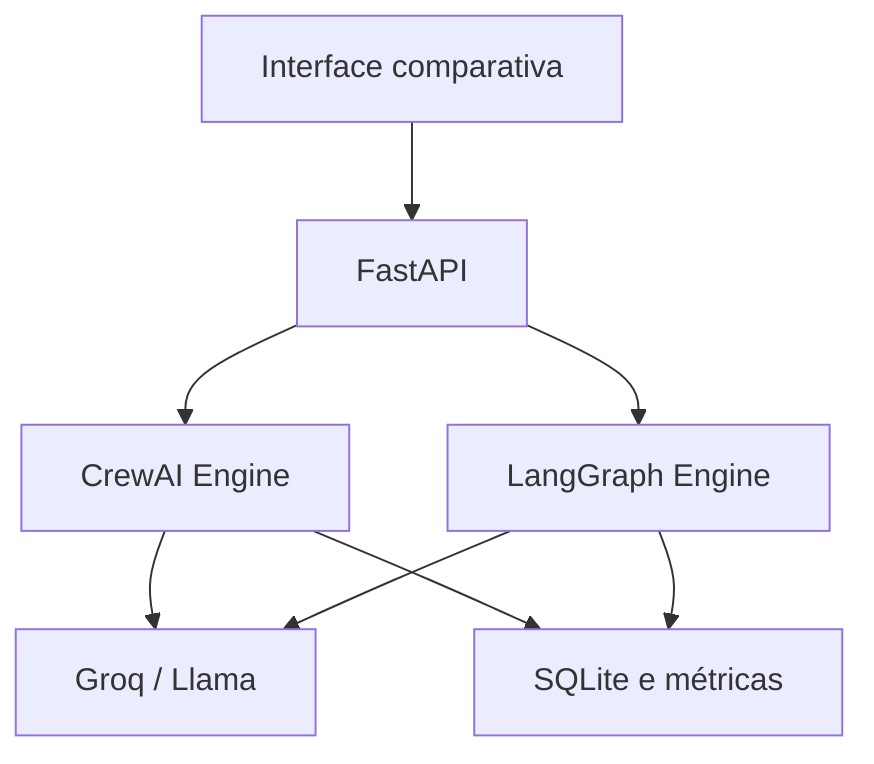

# Multi-Agent Orchestration Lab — CrewAI × LangGraph

[](https://github.com/viniciusds2020/multi-agent-orchestration-lab/actions/workflows/quality.yml)
[](https://docs.crewai.com/)
[](https://docs.langchain.com/oss/python/langgraph/)
[](https://console.groq.com/docs/)

Laboratório comparativo que implementa o mesmo processo multiagente com CrewAI e LangGraph. A aplicação permite observar como colaboração orientada a papéis e orquestração explícita por estados resolvem a mesma missão.

## Caso de uso

Uma equipe de quatro agentes analisa projetos de IA:

1. **Planejador:** decompõe objetivo e entregas;
2. **Pesquisador:** identifica evidências, restrições e riscos;
3. **Arquiteto de IA:** projeta componentes, segurança e observabilidade;
4. **Crítico:** revisa lacunas e critérios de aceite.

## Comparação

| Dimensão | CrewAI | LangGraph |
|---|---|---|
| Abstração | papéis, agentes, tarefas e crews | estado, nós, arestas e comandos |
| Fluxo implementado | processo sequencial com contexto | grafo tipado explícito |
| Principal força | velocidade de prototipação | controle, persistência e auditoria |
| Evolução natural | delegação e processos hierárquicos | ciclos, checkpoints e human-in-the-loop |

## Arquitetura



## Segurança e custos

O modo padrão é **simulação**: não exige chave, não consome tokens e não executa ferramentas externas. O modo ao vivo somente é habilitado quando `GROQ_API_KEY` está configurada. Prompts tratam contexto como dado não confiável; ferramentas e ações externas não fazem parte do MVP.

## Instalação

```bash
git clone https://github.com/viniciusds2020/multi-agent-orchestration-lab.git
cd multi-agent-orchestration-lab
python -m venv .venv
source .venv/bin/activate
pip install -e ".[all,dev]"
cp .env.example .env
multi-agent-lab
```

Acesse:

- interface: http://localhost:8000
- Swagger: http://localhost:8000/docs
- health check: http://localhost:8000/health

## Groq

```env
GROQ_API_KEY=gsk_...
GROQ_MODEL=llama-3.3-70b-versatile
```

Na interface, marque **Usar Groq ao vivo**. CrewAI utiliza seu adaptador de LLM; LangGraph executa nós explícitos usando o SDK Groq.

## Docker

```bash
docker compose up --build
```

## API

| Método | Endpoint | Finalidade |
|---|---|---|
| GET | `/api/capabilities` | motores e modo disponível |
| POST | `/api/execute` | executar um motor |
| POST | `/api/compare` | executar os dois motores |
| GET | `/api/runs` | histórico e métricas |

## Testes

```bash
ruff check src tests
pytest --cov=orchestration_lab
```

Os testes cobrem ambos os motores no modo simulado, API e persistência sem consumir tokens.

## Roadmap

- [ ] checkpoint SQLite no LangGraph;
- [ ] aprovação humana com `interrupt()`;
- [ ] processo hierárquico no CrewAI;
- [ ] streaming de eventos por agente;
- [ ] ferramentas MCP com allowlist;
- [ ] avaliação LLM-as-judge e critérios determinísticos;
- [ ] comparação de custo, qualidade e latência em múltiplas execuções;
- [ ] integração com o AI Automation Hub.

## Referências

- [CrewAI Documentation](https://docs.crewai.com/)
- [LangGraph Graph API](https://docs.langchain.com/oss/python/langgraph/use-graph-api)
- [LangGraph Persistence](https://docs.langchain.com/oss/python/langgraph/persistence)
- [Groq Text Generation](https://console.groq.com/docs/text-chat)

## Autor

Desenvolvido por [Vinicius de Sousa](https://github.com/viniciusds2020).

